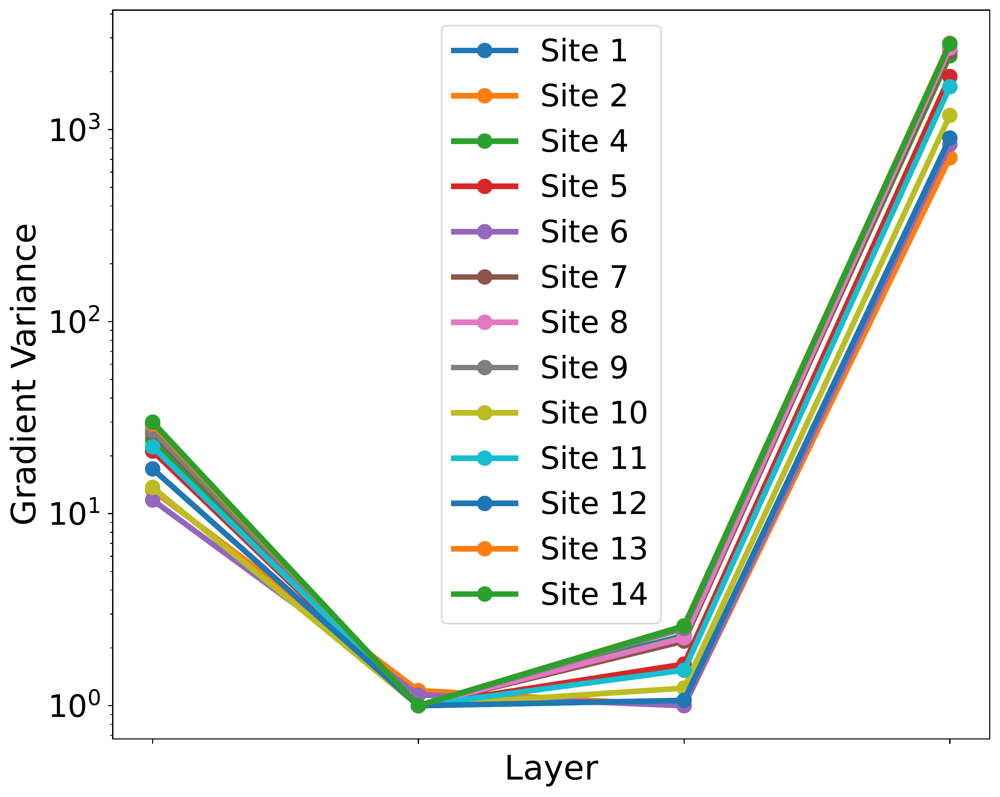
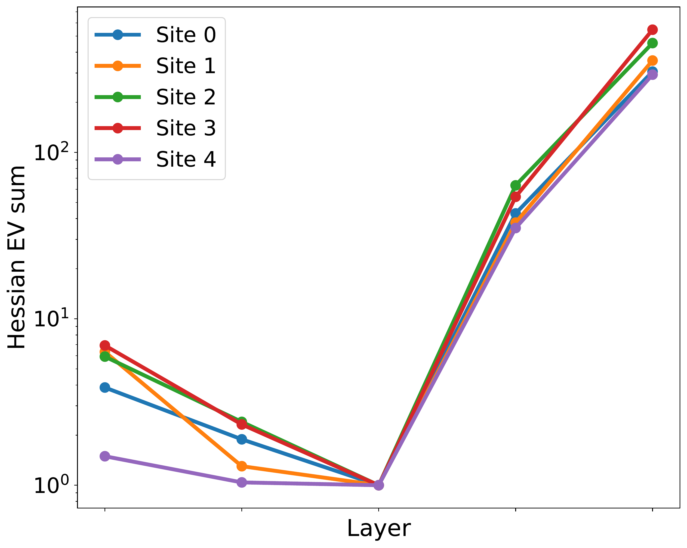
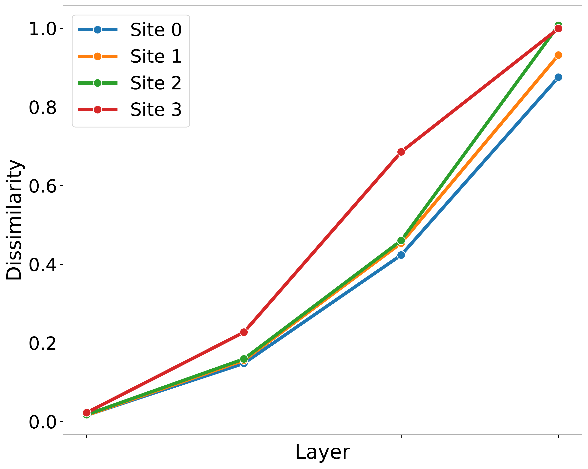

# Appendix

Below we include additional information regarding metrics, training, analysis as well as presenting additional results.
## Metric definitions
### Gradient variance
Gradient variance is proposed by \cite{jiang2019fantastic} and is defined as:
$$
\text{Var}(\nabla\theta_i):=\frac{1}{n}\sum_{j=1}^n\left( \nabla\theta_i^j - \overline{\nabla\theta_i} \right)^T\left( \nabla\theta_i^j - \overline{\nabla\theta_i} \right)
$$
where $\theta_i^j$ is parameter $j$ in layer $i$, $ \nabla\theta_i^j$ is the gradient with respect to that parameter and $\overline{\nabla\theta_i}$ is the mean gradient of all parameters in layer $i$.

### Hessian eigenvalue sum
Hessian eigenvalue sum is proposed by \cite{chaudhari2019entropy}. The Hessian at layer $i$, denoted $H_i$, is a square matrix of second-order partial derivatives with respect to parameters at layer $i$. Each entry in $H_i$ is defined as:
$$
(H_i)_{jk} = \frac{\partial^2L}{\partial\theta_i^j\partial\theta_i^k}
$$
where $\theta_i^j$ and $\theta_i^k$ are parameters $j$ and $k$ in layer $i$, $L$ is the loss and $\partial.$ is the partial derivative with respect to that parameter. The sum of the eigenvalues is then calculated as:
$$
\text{Tr}(H_i) = \sum_{p=1}^n \lambda_i^p
$$
where $\lambda_i^p$ is the $p^{th}$ eigenvalue of $H_i$.

### Sample representation similarity
Sample representation similarity is calculated via Centered Kernel Alignment (CKA) which is proposed by \cite{kornblith2019similarity}. Its calculated as:
$$
\frac{||Y_i^TX_i||_F^2}{||X_i^TX_i||_F^2||Y_i^TY_i||_F^2}
$$
where $X_i$ and $Y_i$ are sample representations after layer $i$ coming from two distinct models.

### F1 score
Multi-class macro-averaged F1 score is calculated as
$$
\text{F1}_{\text{macro}} = \frac{1}{N}\sum_{i=1}^N 2 \cdot \frac{\text{precision}_i \cdot \text{recall}_i}{\text{precision}_i + \text{recall}_i}
$$
where $N$ is the number of classes, and precision$_i$ and recall$_i$ are the precision and recall for class $i$. This equation gives equal weight to all classes which is useful in imbalanced datasets like ours.

### Algorithm Fairness
Fairness is calculated as described in \cite{divi2021new} - the variance in individual client performances on their local test set:
$$
\text{Fairness} = \frac{1}{C}\sum_{c=1}^C \left( P_c - \overline{P_c}\right)^2
$$
where $C$ is the number of clients, $P_c$ is the performance of client $c$ and $\overline{P_c}$ is the average performance of all clients for a given personalized algorithm.

### Algorithm Incentivization
Incentivization is defined as in \cite{cho2022federate} - the percentage of clients that outperform their local site model or global model from FedAvg:
$$
\text{Incentivization} = \frac{1}{C}\sum_{c=1}^C \mathbb{I} \{ P_c > \max(S_c, G_c) \}
$$
where $C$ is the number of clients, $P_c$ is performance of the personalized model in client $c$, $S_c$ is the performance of the local site model in client $c$, and $G_c$ is the performance of the global Fed Avg model in client $c$.

## Datasets

Table: Dataset descriptions

| Dataset           | Description                                     | Classes | Partition                   |
| :---------------- | :---------------------------------------------- | :------ | :-------------------------- |
| FashionMNIST      | Fashion images                                  | 10      | Label skew $Dir \sim (0.5)$ |
| EMNIST            | Handwritten digit and character images          | 62      | Label skew $Dir \sim (0.5)$ |
| CIFAR-10          | Color images                                    | 10      | Label skew $Dir \sim (0.5)$ |
| ISIC-2019         | Skin lesion images taken via dermoscopy         | 4       | Data collected from 4 hospitals |
| Fed-Heart-Disease | Tabular data of patients with heart disease     | 5       | Data collected from 5 hospitals |
| Sent-140          | Sentiment classification of tweets              | 2       | Data collected from 15 users |
| MIMIC-III         | Mortality prediction using patient admission note | 2       | Data grouped by patient admitting diagnosis |

For FashionMNIST, EMNIST, and CIFAR-10 we create non-IID datasets by via label skew using a a dirichlet distribution ($\alpha = 0.5)$. The remaining datasets have a natural partition that we adhere to. For Sent-140 we select the top 15 users by tweet count.

## Model architectures and Transition point

Table: Model architectures and transition points identified by federation sensitivity metric.

| Dataset      | Architecture                                                      | Transition Point    |
| :----------- | :---------------------------------------------------------------- | :------------------ |
| FashionMNIST | \{3$\times$Conv-2$\times$FC\}                                     | Conv$_3$            |
| EMNIST       | \{3$\times$Conv-2$\times$FC\}                                     | Conv$_3$            |
| CIFAR-10     | \{5$\times$Conv-2$\times$FC\}                                     | Conv$_5$            |
| ISIC-2019    | \{5$\times$Conv-2$\times$FC\}                                     | Conv$_5$            |
| Sent-140     | \{Position$\oplus$Token Emb-Attention$\oplus$Residual-FC$\oplus$Projection-FC\} | FC$_1\oplus$Projection |
| MIMIC-III    | \{Position$\oplus$Token Emb-Attention$\oplus$Residual-FC$\oplus$Projection-FC\} | FC$_1\oplus$Projection |
| Fed-Heart    | \{4$\times$ FC\}                                                  | FC$_2$              |

\*FC = Fully connected layer

## Model training

Table: Learning rates used

| Algorithm         | FMNIST           | EMNIST           | CIFAR            | ISIC             | Heart            | Sent-140         | MIMIC-III        |
| :---------------- | :--------------- | :--------------- | :--------------- | :--------------- | :--------------- | :--------------- | :--------------- |
| Local client      | $1\cdot 10^{-3}$ | $1\cdot 10^{-3}$ | $1\cdot 10^{-3}$ | $1\cdot 10^{-3}$ | $5\cdot 10^{-2}$ | $5\cdot 10^{-4}$ | $8\cdot 10^{-5}$ |
| FedAvg            | $5\cdot 10^{-4}$ | $1\cdot 10^{-3}$ | $1\cdot 10^{-3}$ | $1\cdot 10^{-3}$ | $1\cdot 10^{-1}$ | $1\cdot 10^{-3}$ | $5\cdot 10^{-4}$ |
| FedProx           | $5\cdot 10^{-4}$ | $5\cdot 10^{-3}$ | $1\cdot 10^{-3}$ | $1\cdot 10^{-3}$ | $5\cdot 10^{-2}$ | $1\cdot 10^{-3}$ | $5\cdot 10^{-4}$ |
| pFedMe            | $5\cdot 10^{-2}$ | $5\cdot 10^{-2}$ | $5\cdot 10^{-2}$ | $5\cdot 10^{-3}$ | $1\cdot 10^{-1}$ | $1\cdot 10^{-2}$ | $1\cdot 10^{-3}$ |
| Ditto             | $5\cdot 10^{-4}$ | $1\cdot 10^{-3}$ | $1\cdot 10^{-3}$ | $1\cdot 10^{-3}$ | $5\cdot 10^{-2}$ | $1\cdot 10^{-3}$ | $5\cdot 10^{-4}$ |
| LocalAdaptation   | $5\cdot 10^{-4}$ | $1\cdot 10^{-3}$ | $1\cdot 10^{-3}$ | $1\cdot 10^{-3}$ | $1\cdot 10^{-2}$ | $1\cdot 10^{-3}$ | $5\cdot 10^{-4}$ |
| BABU              | $1\cdot 10^{-3}$ | $1\cdot 10^{-3}$ | $5\cdot 10^{-4}$ | $1\cdot 10^{-3}$ | $1\cdot 10^{-1}$ | $8\cdot 10^{-5}$ | $5\cdot 10^{-4}$ |
| PLayer-FL         | $1\cdot 10^{-3}$ | $1\cdot 10^{-3}$ | $1\cdot 10^{-3}$ | $5\cdot 10^{-4}$ | $1\cdot 10^{-2}$ | $8\cdot 10^{-5}$ | $3\cdot 10^{-4}$ |
| PLayer-FL-1       | $1\cdot 10^{-3}$ | $5\cdot 10^{-4}$ | $1\cdot 10^{-3}$ | $5\cdot 10^{-4}$ | $5\cdot 10^{-2}$ | $8\cdot 10^{-5}$ | $8\cdot 10^{-5}$ |
| PLayer-FL+1       | $1\cdot 10^{-3}$ | $1\cdot 10^{-3}$ | $5\cdot 10^{-4}$ | $1\cdot 10^{-3}$ | $5\cdot 10^{-2}$ | $1\cdot 10^{-4}$ | $5\cdot 10^{-4}$ |

Table: Learning rate grid, loss function, number of epochs and number of runs for each dataset

| Dataset    | Learning rate grid                           | Loss             | Epochs | Runs |
| :--------- | :--------------------------------------------- | :--------------- | :----- | :--- |
| FashionMNIST | $1\cdot10^{-3}$, $5\cdot10^{-4}$, $1\cdot10^{-4}$, $8\cdot10^{-5}$ | Cross Entropy    | 75     | 10   |
| EMNIST     | $5\cdot10^{-3}$, $1\cdot10^{-3}$, $5\cdot10^{-4}$, $1\cdot10^{-4}$, $8\cdot10^{-5}$ | Cross Entropy    | 75     | 10   |
| CIFAR-10   | $5\cdot10^{-3}$, $1\cdot10^{-3}$, $5\cdot10^{-4}$, $1\cdot10^{-4}$ | Cross Entropy    | 50     | 10   |
| ISIC-2019  | $1\cdot10^{-3}$, $5\cdot10^{-3}$, $1\cdot10^{-4}$ | Multiclass Focal | 50     | 3    |
| Sent-140   | $1\cdot10^{-3}$, $5\cdot10^{-4}$, $1\cdot10^{-4}$, $8\cdot10^{-5}$ | Cross Entropy    | 75     | 20   |
| Heart      | $5\cdot10^{-1}$, $1\cdot10^{-1}$, $5\cdot10^{-2}$, $1\cdot10^{-2}$, $5\cdot10^{-3}$ | Multiclass Focal | 50     | 50   |
| MIMIC-III  | $5\cdot10^{-4}$, $1\cdot10^{-4}$, $3\cdot10^{-4}$, $8\cdot10^{-5}$ | Multiclass Focal | 50     | 10   |

Table \ref{supp:lr} presents the learning rates utilized for each algorithm and Table \ref{supp:hyperparams} presents the learning rate grid explored, in addition to the loss function, the number of training epochs, and the count of independent training runs. With the exception of pFedME, the AdamW optimizer was used for all algorithms. For pFedME, we adopted the specific optimizer presented by the original authors, which integrates Moreau envelopes into the training process \cite{t2020pfedme}. To account for this, we multiply the learning rate grid tested by 100 as early testing showed the pFedME optimizer demonstrated improved performance with higher learning rates. All experiments were ran on 1 Tesla V100 16GB node.

## Comparing models trained on non-IID data

### Gradient variance

Figures \ref{sfig:grad_var_first}, \ref{sfig:grad_var_best}, and \ref{sfig:grad_var_best_fl} display the gradient variance across all datasets, corresponding to the models trained for a single epoch, final model after independent training, and final model after FL training, respectively.

Figure: Layer gradient variance after one epoch. All models identically initialized and independently trained on non-IID data.
 (A) FashionMNIST
 (B) EMNIST
 (C) CIFAR-10
 (D) ISIC-2019
 (E) Sent-140
 (F) MIMIC-III
 (G) Fed-Heart-Disease

Figure: Layer gradient variance for final models. All models identically initialized and independently trained on non-IID data.
 (A) FashionMNIST
 (B) EMNIST
 (C) CIFAR-10
 (D) ISIC-2019
 (E) Sent-140
 (F) MIMIC-III
 (G) Fed-Heart-Disease

Figure: Layer gradient variance for final models. Models trained via FL on non-IID data.
 (A) FashionMNIST
 (B) EMNIST
 (C) CIFAR-10
 (D) ISIC-2019
 (E) Sent-140
 (F) MIMIC-III
 (G) Fed-Heart-Disease

### Hessian eigenvalue sum

Figures \ref{sfig:hess_eig_first}, \ref{sfig:hess_eig_best}, and \ref{sfig:hess_eig_best_fl} display the hessian eigenvalue sum across all datasets, corresponding to the models trained for a single epoch, final model after independent training, and final model after FL training, respectively.

Figure: Layer hessian eigenvalue sum after one epoch. All models identically initialized and independently trained on non-IID data.
 (A) FashionMNIST
 (B) EMNIST
 (C) CIFAR-10
 (D) ISIC-2019
 (E) Sent-140
 (F) MIMIC-III
 (G) Fed-Heart-Disease

Figure: Layer hessian eigenvalue sum for the final models. All models identically initialized and independently trained on non-IID data.
 (A) FashionMNIST
 (B) EMNIST
 (C) CIFAR-10
 (D) ISIC-2019
 (E) Sent-140
 (F) MIMIC-III
 (G) Fed-Heart-Disease

Figure: Layer hessian eigenvalue sum for the final models. Models trained via FL on non-IID data.
 (A) FashionMNIST
 (B) EMNIST
 (C) CIFAR-10
 (D) ISIC-2019
 (E) Sent-140
 (F) MIMIC-III
 (G) Fed-Heart-Disease

### Sample representation

Figures \ref{sfig:sample_rep_first} and \ref{sfig:sample_rep_best} display the sample representation across all datasets, corresponding to the models trained for a single epoch and the final models, respectively.

Figure: Layer sample representation similarity after one epoch. All models identically initialized and independently trained on non-IID data.
 (A) FashionMNIST
 (B) EMNIST
 (C) CIFAR-10
 (E) Sent-140
 (F) MIMIC-III
 (G) Fed-Heart-Disease

Figure: Layer sample representation similarity for final models. All models identically initialized and independently trained on non-IID data.
 (A) FashionMNIST
 (B) EMNIST
 (C) CIFAR-10
 (E) Sent-140
 (F) MIMIC-III
 (G) Fed-Heart-Disease

### Federated sensitivity

Figures \ref{sfig:layer_imp_best} and \ref{sfig:layer_imp_best_fl} display the federated sensitivity score across all datasets for the final model after independent training, and final model after FL training, respectively.

Figure: Federation sensitivity for final models. All models identically initialized and independently trained on non-IID data.
 (A) FashionMNIST
 (B) EMNIST
 (C) CIFAR-10
 (D) ISIC-2019
 (E) Sent-140
 (F) MIMIC-III
 (G) Fed-Heart-Disease

Figure: Federation sensitivity for final models. Models trained via FL on non-IID data.
 (A) FashionMNIST
 (B) EMNIST
 (C) CIFAR-10
 (D) ISIC-2019
 (E) Sent-140
 (F) MIMIC-III
 (G) Fed-Heart-Disease

## Results

### F1 score: fairness and incentive

Table: Variance in clients' F1 score (fairness). In **bold** is fairest model. Friedman rank test p-value $<5\times10^{-3}$

| Algorithm          | FMNIST          | EMNIST          | CIFAR           | ISIC            | Heart           | Sent-140        | MIMIC-III       | Rank |
| :----------------- | :-------------- | :-------------- | :-------------- | :-------------- | :-------------- | :-------------- | :-------------- | :--- |
| Fedprox            | $3.0\cdot 10^{-4}$ | $8.0\cdot 10^{-4}$ | $4.0\cdot 10^{-4}$ | $1.1\cdot 10^{-2}$ | $9.0\cdot 10^{-2}$ | $4.1\cdot 10^{-3}$ | $1.7\cdot 10^{-3}$ | 7.7  |
| pFedMe             | $3.0\cdot 10^{-4}$ | $6.0\cdot 10^{-4}$ | $5.0\cdot 10^{-4}$ | $4.2\cdot 10^{-3}$ | $\mathbf{7.1\cdot 10^{-2}}$ | $3.7\cdot 10^{-2}$ | $\mathbf{1.4\cdot 10^{-3}}$ | 4.3  |
| Ditto              | $5.0\cdot 10^{-4}$ | $6.0\cdot 10^{-4}$ | $2.0\cdot 10^{-4}$ | $3.6\cdot 10^{-3}$ | $8.2\cdot 10^{-2}$ | $3.6\cdot 10^{-2}$ | $1.6\cdot 10^{-3}$ | 5.0  |
| LocalAdaptation    | $\mathbf{1.0\cdot 10^{-4}}$ | $7.0\cdot 10^{-4}$ | $4.0\cdot 10^{-4}$ | $9.0\cdot 10^{-3}$ | $8.3\cdot 10^{-2}$ | $4.1\cdot 10^{-2}$ | $2.2\cdot 10^{-3}$ | 6.4  |
| FedBABU            | $2.0\cdot 10^{-4}$ | $4.0\cdot 10^{-4}$ | $4.0\cdot 10^{-4}$ | $2.1\cdot 10^{-3}$ | $8.4\cdot 10^{-2}$ | $3.5\cdot 10^{-2}$ | $2.0\cdot 10^{-3}$ | 4.4  |
| FedLP              | $3.0\cdot 10^{-4}$ | $4.0\cdot 10^{-4}$ | $1.0\cdot 10^{-3}$ | $1.1\cdot 10^{-2}$ | $8.5\cdot 10^{-2}$ | $3.7\cdot 10^{-2}$ | $1.6\cdot 10^{-3}$ | 6.1  |
| FedLAMA            | $2.0\cdot 10^{-4}$ | $6.0\cdot 10^{-4}$ | $5.0\cdot 10^{-4}$ | $4.7\cdot 10^{-3}$ | $8.7\cdot 10^{-2}$ | $4.1\cdot 10^{-2}$ | $2.0\cdot 10^{-3}$ | 5.6  |
| pFedLA             | $4.0\cdot 10^{-4}$ | $1.0\cdot 10^{-4}$ | $\mathbf{1.0\cdot 10^{-4}}$ | $3.5\cdot 10^{-3}$ | $7.4\cdot 10^{-2}$ | $4.1\cdot 10^{-2}$ | $2.1\cdot 10^{-3}$ | 5.1  |
| PLayer-FL          | $4.0\cdot 10^{-4}$ | $5.0\cdot 10^{-4}$ | $6.0\cdot 10^{-4}$ | $1.3\cdot 10^{-3}$ | $7.3\cdot 10^{-2}$ | $\mathbf{3.3\cdot 10^{-2}}$ | $1.5\cdot 10^{-3}$ | **3.8** |
| PLayer-FL-Random | $8.0\cdot 10^{-4}$ | $\mathbf{3.0\cdot 10^{-4}}$ | $1.0\cdot 10^{-3}$ | $\mathbf{7.0\cdot 10^{-4}}$ | $7.3\cdot 10^{-2}$ | $3.4\cdot 10^{-2}$ | $1.9\cdot 10^{-3}$ | 6.5  |

Table: Incentivized participation rate (%) using F1 score. In **bold** is model with highest IPR. Friedman rank test p-value $=0.043$

| Algorithm          | FMNIST | EMNIST | CIFAR | ISIC | Heart | Sentiment | Mimic-III | Rank |
| :----------------- | :----- | :----- | :---- | :--- | :---- | :-------- | :-------- | :--- |
| FedProx            | 0.0    | 20.0   | 40.0  | 0.0  | 0.0   | 6.7       | 50.0      | 5.4  |
| pFedMe             | 80.0   | 20.0   | 0.0   | 0.0  | **50.0** | 6.7       | 0.0       | 5.1  |
| Ditto              | 60.0   | 0.0    | 0.0   | 0.0  | 0.0   | **26.7** | 25.0      | 5.6  |
| LocalAdaptation    | 0.0    | 40.0   | 40.0  | 0.0  | 0.0   | 0.0       | **75.0** | 5.2  |
| FedBABU            | 0.0    | 40.0   | 80.0  | 0.0  | 0.0   | 20.0      | 50.0      | 4.4  |
| FedLP              | 0.0    | **60.0** | 0.0   | 0.0  | 0.0   | 6.7       | 50.0      | 6.2  |
| FedLAMA            | 0.0    | 0.0    | 0.0   | 0.0  | 0.0   | 0.0       | 25.0      | 7.3  |
| pFedLA             | 0.0    | 0.0    | 0.0   | 0.0  | 0.0   | 0.0       | 0.0       | 7.7  |
| PLayer-FL          | **100.0** | 0.0    | **100.0** | 0.0  | 25.0  | 20.0      | 50.0      | **3.4** |
| PLayer-FL-Random | 60.0   | 0.0    | 80.0  | 0.0  | 25.0  | 6.7       | 25.0      | 4.8  |

## Accuracy

Table: Accuracy and average rank. In **bold** is the top-performing model. Friedman rank test p-value $<5\times10^{-3}$

| Algorithm        | FMNIST     | EMNIST     | CIFAR      | ISIC       | Heart      | Sentiment  | mimic      | Avg Rank |
| :--------------- | :--------- | :--------- | :--------- | :--------- | :--------- | :--------- | :--------- | :------- |
| Local            | 88.7 ± 0.9 | 84.2 ± 0.9 | 79.4 ± 1.3 | **68.9 ± 1.8** | 53.7 ± 1.0 | 79.8 ± 0.3 | 74.7 ± 2.1 | 6.7      |
| FedAvg           | 89.1 ± 0.5 | **86.5 ± 0.6** | 80.0 ± 0.6 | 66.4 ± 1.2 | 54.1 ± 0.7 | 78.8 ± 0.2 | 74.7 ± 0.6 | 6.4      |
| FedProx          | 89.2 ± 0.4 | 86.2 ± 0.9 | 80.2 ± 0.6 | 66.5 ± 1.6 | 52.9 ± 1.6 | 78.8 ± 0.2 | **75.7 ± 1.7** | 6.4      |
| pFedMe           | 88.2 ± 0.8 | 85.7 ± 0.9 | 67.4 ± 1.1 | 66.8 ± 0.6 | 55.0 ± 1.0 | 80.0 ± 0.2 | 73.3 ± 0.9 | 6.9      |
| Ditto            | 89.0 ± 0.6 | 85.6 ± 1.1 | 67.8 ± 0.8 | 66.0 ± 1.0 | **55.5 ± 1.0** | 80.3 ± 0.6 | 73.5 ± 0.9 | 7.0      |
| LocalAdaptation  | 89.3 ± 0.8 | 86.3 ± 0.6 | 80.0 ± 1.1 | 66.9 ± 0.2 | 53.8 ± 0.8 | 78.9 ± 0.3 | 74.0 ± 2.2 | 6.3      |
| FedBABU          | 89.2 ± 0.6 | 86.4 ± 0.7 | 80.7 ± 1.4 | 67.3 ± 1.6 | 54.2 ± 0.7 | **81.0 ± 0.2** | 74.9 ± 0.6 | 3.4      |
| FedLP            | 89.1 ± 0.6 | 86.3 ± 0.9 | 78.6 ± 1.6 | 66.6 ± 0.7 | 54.1 ± 0.7 | 79.4 ± 0.3 | 74.6 ± 1.3 | 7.0      |
| FedLama          | 86.3 ± 0.8 | 83.3 ± 0.6 | 63.4 ± 2.0 | 62.4 ± 1.5 | 54.7 ± 0.8 | 78.0 ± 0.1 | 75.2 ± 1.2 | 8.9      |
| pFedLA           | 70.8 ± 0.2 | 41.2 ± 2.7 | 37.1 ± 2.3 | 56.7 ± 1.6 | 52.6 ± 1.4 | 78.0 ± 0.0 | 74.7 ± 2.6 | 11.1     |
| PLayer-FL        | **89.8 ± 0.7** | 86.1 ± 0.8 | **81.5 ± 1.1** | 68.6 ± 0.8 | 55.4 ± 1.2 | 80.7 ± 0.7 | **75.7 ± 0.6** | **2.2** |
| PLayer-FL-Random | 89.2 ± 0.7 | 84.1 ± 0.8 | 81.2 ± 1.2 | 68.6 ± 0.8 | 54.4 ± 1.2 | 79.0 ± 0.4 | 74.5 ± 2.0 | 5.8      |

Table: Variance in clients' accuracy (fairness). In **bold** is the fairest model. Friedman rank test p-value $<5\times10^{-3}$

| Algorithm          | FMNIST          | EMNIST          | CIFAR           | ISIC            | Heart           | Sentiment       | mimic           | Avg Rank |
| :----------------- | :-------------- | :-------------- | :-------------- | :-------------- | :-------------- | :-------------- | :-------------- | :------- |
| FedProx            | $1.0\cdot 10^{-4}$ | $3.0\cdot 10^{-4}$ | $1.0\cdot 10^{-4}$ | $3.5\cdot 10^{-2}$ | $6.7\cdot 10^{-2}$ | $2.4\cdot 10^{-2}$ | $1.1\cdot 10^{-2}$ | 5.7      |
| pFedMe             | $\mathbf{1.0\cdot 10^{-5}}$ | $3.0\cdot 10^{-4}$ | $4.0\cdot 10^{-4}$ | $3.3\cdot 10^{-2}$ | $4.6\cdot 10^{-2}$ | $2.1\cdot 10^{-2}$ | $1.4\cdot 10^{-2}$ | 5.0      |
| ditto              | $1.0\cdot 10^{-4}$ | $2.0\cdot 10^{-4}$ | $3.0\cdot 10^{-4}$ | $3.5\cdot 10^{-2}$ | $5.7\cdot 10^{-2}$ | $2.3\cdot 10^{-2}$ | $1.3\cdot 10^{-2}$ | 5.3      |
| LocalAdaptation    | $1.0\cdot 10^{-4}$ | $2.0\cdot 10^{-4}$ | $2.0\cdot 10^{-4}$ | $3.2\cdot 10^{-2}$ | $5.7\cdot 10^{-2}$ | $2.4\cdot 10^{-2}$ | $1.4\cdot 10^{-2}$ | 5.5      |
| FedBABU            | $1.0\cdot 10^{-4}$ | $2.0\cdot 10^{-4}$ | $1.0\cdot 10^{-4}$ | $3.3\cdot 10^{-2}$ | $6.0\cdot 10^{-2}$ | $\mathbf{1.8\cdot 10^{-2}}$ | $1.2\cdot 10^{-2}$ | 4.9      |
| FedLP              | $1.0\cdot 10^{-4}$ | $2.0\cdot 10^{-4}$ | $1.0\cdot 10^{-4}$ | $3.6\cdot 10^{-2}$ | $5.7\cdot 10^{-2}$ | $2.2\cdot 10^{-2}$ | $1.5\cdot 10^{-2}$ | 5.3      |
| FedLama            | $1.0\cdot 10^{-4}$ | $2.0\cdot 10^{-4}$ | $3.0\cdot 10^{-4}$ | $4.2\cdot 10^{-3}$ | $6.3\cdot 10^{-2}$ | $2.6\cdot 10^{-2}$ | $1.3\cdot 10^{-2}$ | 7.1      |
| pFedLA             | $9.0\cdot 10^{-4}$ | $6.0\cdot 10^{-4}$ | $2.3\cdot 10^{-3}$ | $6.3\cdot 10^{-2}$ | $5.1\cdot 10^{-2}$ | $2.6\cdot 10^{-2}$ | $2.5\cdot 10^{-2}$ | 8.9      |
| PLayer-FL          | $1.0\cdot 10^{-4}$ | $\mathbf{1.0\cdot 10^{-4}}$ | $1.0\cdot 10^{-4}$ | $\mathbf{2.9\cdot 10^{-2}}$ | $4.7\cdot 10^{-2}$ | $1.9\cdot 10^{-2}$ | $1.3\cdot 10^{-2}$ | **2.5** |
| PLayer-FL-Random | $1.0\cdot 10^{-4}$ | $3.0\cdot 10^{-4}$ | $\mathbf{1.0\cdot 10^{-4}}$ | $\mathbf{2.9\cdot 10^{-2}}$ | $5.7\cdot 10^{-2}$ | $2.5\cdot 10^{-2}$ | $\mathbf{9.7\cdot 10^{-3}}$ | 4.9      |

Table: Incentivized Participation Rate using accuracy (%). In **bold** is model with highest IPR. Friedman rank test p-value $<5\times10^{-3}$

| Algorithm          | FMNIST | EMNIST | CIFAR | ISIC | Heart | Sent-140 | Mimic-III | Avg Rank |
| :----------------- | :----- | :----- | :---- | :--- | :---- | :------- | :-------- | :------- |
| FedProx            | 20.0   | **40.0** | 40.0  | 0.0  | 0.0   | 0.0      | 50.0      | 5.6      |
| pFedMe             | 40.0   | **40.0** | 0.0   | 0.0  | **25.0** | 6.7      | 0.0       | 5.6      |
| Ditto              | 60.0   | 0.0    | 0.0   | 0.0  | 0.0   | 6.7      | 0.0       | 6.8      |
| LocalAdaptation    | 60.0   | 40.0   | 60.0  | 0.0  | 0.0   | 0.0      | 25.0      | 5.3      |
| FedBABU            | 80.0   | 20.0   | 60.0  | 0.0  | 0.0   | **20.0** | **25.0** | 4.3      |
| FedLP              | 60.0   | 20.0   | 20.0  | 0.0  | 0.0   | 6.7      | **25.0** | 5.4      |
| FedLama            | 0.0    | 0.0    | 0.0   | 0.0  | 0.0   | 0.0      | 0.0       | 8.1      |
| pFedLA             | 0.0    | 0.0    | 0.0   | 0.0  | 25.0  | 0.0      | 50.0      | 6.5      |
| PLayer-FL          | **80.0** | 0.0    | **100.0** | **25.0** | **25.0** | **20.0** | **75.0** | **2.4** |
| PLayer-FL-Random | 40.0   | 0.0    | **100.0** | **25.0** | 0.0   | 6.7      | 25.0      | 4.9      |

## Loss

Table: Test loss ($\times 1\cdot10^{-4}$) and average rank. In **bold** is the top-performing model. Friedman rank test p-value $<5\times10^{-3}$

| Algorithm     | FMNIST     | EMNIST     | CIFAR      | ISIC       | Heart      | Sentiment  | mimic      | Avg Rank |
| :------------ | :--------- | :--------- | :--------- | :--------- | :--------- | :--------- | :--------- | :------- |
| Local client  | 34.7 ± 2.0 | 58.6 ± 3.7 | 60.7 ± 4.3 | **111.2 ± 0.3** | 29.6 ± 0.8 | 43.7 ± 0.3 | 71.4 ± 0.8 | 8.3      |
| FedAvg        | 30.7 ± 1.1 | 42.2 ± 2.8 | 57.4 ± 3.1 | 121.8 ± 1.6 | 27.5 ± 0.5 | 44.1 ± 0.2 | 65.8 ± 0.9 | 6.1      |
| FedProx       | 31.5 ± 1.9 | 41.6 ± 2.9 | 56.3 ± 1.3 | 121.6 ± 1.1 | 28.4 ± 0.9 | 43.9 ± 0.2 | 65.8 ± 1.1 | 6.3      |
| pFedMe        | 30.4 ± 2.3 | 42.9 ± 2.7 | 90.9 ± 2.8 | 118.0 ± 1.0 | 26.4 ± 0.9 | 42.2 ± 0.6 | 67.4 ± 0.8 | 5.1      |
| Ditto         | 30.8 ± 0.2 | 45.0 ± 3.0 | 89.9 ± 3.9 | 120.6 ± 2.5 | **26.2 ± 0.4** | 42.5 ± 0.6 | 67.3 ± 0.1 | 5.9      |
| LocalAdaptation | 30.5 ± 1.9 | **41.1 ± 3.4** | 57.0 ± 3.0 | 121.4 ± 1.3 | 28.1 ± 0.6 | 43.6 ± 0.1 | 65.7 ± 0.6 | 4.9      |
| FedBABU       | 30.0 ± 1.9 | 42.2 ± 3.5 | 55.2 ± 2.8 | 120.6 ± 1.5 | 29.1 ± 1.0 | 41.8 ± 0.2 | 65.5 ± 0.7 | 3.8      |
| FedLP         | 30.1 ± 1.0 | 43.1 ± 3.2 | 61.4 ± 3.6 | 128.7 ± 1.5 | 27.3 ± 0.5 | 42.9 ± 0.2 | 65.8 ± 0.6 | 6.7      |
| FedLAMA       | 37.6 ± 2.0 | 53.2 ± 2.3 | 102.4 ± 3.0 | 133.0 ± 1.8 | 27.2 ± 0.5 | 45.0 ± 0.3 | **65.2 ± 0.5** | 8.3      |
| pFedLA        | 88.6 ± 6.9 | 253.4 ± 11.2 | 176.2 ± 10.6 | 151.2 ± 1.8 | 36.1 ± 4.9 | 47.2 ± 0.6 | 75.4 ± 0.6 | 12.0     |
| PLayer-FL     | **27.7 ± 2.0** | 45.4 ± 3.9 | **52.6 ± 2.6** | 113.4 ± 0.6 | 26.7 ± 0.6 | **41.4 ± 0.4** | 66.2 ± 0.7 | **3.4** |
| PLayer-FL-Random | 33.3 ± 2.3 | 58.2 ± 1.8 | 55.6 ± 3.7 | 113.1 ± 1.6 | 27.9 ± 1.0 | 44.6 ± 0.7 | 69.9 ± 1.2 | 7.4      |

Table: Variance in clients' test loss (fairness). In **bold** is the fairest model. Friedman rank test p-value $<5\times10^{-3}$

| Algorithm          | FMNIST          | EMNIST          | CIFAR           | ISIC            | Heart           | Sent-140        | MIMIC-III       | Avg Rank |
| :----------------- | :-------------- | :-------------- | :-------------- | :-------------- | :-------------- | :-------------- | :-------------- | :------- |
| FedProx            | $1.1\cdot 10^{-3}$ | $1.7\cdot 10^{-3}$ | $1.1\cdot 10^{-3}$ | $3.8\cdot 10^{-1}$ | $1.8\cdot 10^{-2}$ | $5.5\cdot 10^{-2}$ | $4.7\cdot 10^{-2}$ | 6.4      |
| pFedMe             | $5.0\cdot 10^{-4}$ | $2.3\cdot 10^{-3}$ | $1.8\cdot 10^{-3}$ | $3.6\cdot 10^{-1}$ | $1.3\cdot 10^{-2}$ | $5.2\cdot 10^{-2}$ | $3.5\cdot 10^{-2}$ | 4.1      |
| Ditto              | $6.0\cdot 10^{-4}$ | $2.2\cdot 10^{-3}$ | $2.3\cdot 10^{-4}$ | $3.8\cdot 10^{-1}$ | $1.7\cdot 10^{-2}$ | $5.2\cdot 10^{-2}$ | $3.8\cdot 10^{-2}$ | 4.6      |
| LocalAdaptation    | $1.0\cdot 10^{-3}$ | $2.1\cdot 10^{-3}$ | $1.2\cdot 10^{-3}$ | $4.0\cdot 10^{-1}$ | $1.9\cdot 10^{-2}$ | $5.5\cdot 10^{-2}$ | $4.8\cdot 10^{-2}$ | 7.1      |
| FedBABU            | $4.0\cdot 10^{-4}$ | $\mathbf{1.2\cdot 10^{-3}}$ | $7.0\cdot 10^{-4}$ | $4.1\cdot 10^{-1}$ | $2.1\cdot 10^{-2}$ | $\mathbf{4.6\cdot 10^{-2}}$ | $4.5\cdot 10^{-2}$ | 4.4      |
| FedLP              | $7.0\cdot 10^{-4}$ | $1.9\cdot 10^{-3}$ | $8.0\cdot 10^{-4}$ | $4.3\cdot 10^{-1}$ | $1.7\cdot 10^{-2}$ | $5.2\cdot 10^{-2}$ | $4.3\cdot 10^{-2}$ | 5.1      |
| FedLAMA            | $\mathbf{2.0\cdot 10^{-4}}$ | $2.9\cdot 10^{-3}$ | $2.4\cdot 10^{-3}$ | $4.6\cdot 10^{-1}$ | $1.8\cdot 10^{-2}$ | $5.3\cdot 10^{-2}$ | $4.3\cdot 10^{-2}$ | 6.7      |
| pFedLA             | $1.0\cdot 10^{-3}$ | $2.3\cdot 10^{-2}$ | $5.1\cdot 10^{-2}$ | $5.7\cdot 10^{-1}$ | $2.6\cdot 10^{-1}$ | $5.1\cdot 10^{-2}$ | $\mathbf{3.2\cdot 10^{-2}}$ | 7.6      |
| PLayer-FL          | $7.0\cdot 10^{-4}$ | $2.5\cdot 10^{-3}$ | $4.0\cdot 10^{-4}$ | $\mathbf{3.2\cdot 10^{-1}}$ | $\mathbf{1.4\cdot 10^{-2}}$ | $5.1\cdot 10^{-2}$ | $4.2\cdot 10^{-2}$ | **3.6** |
| PLayer-FL-Random | $8.0\cdot 10^{-4}$ | $4.1\cdot 10^{-3}$ | $\mathbf{1.0\cdot 10^{-4}}$ | $\mathbf{3.2\cdot 10^{-1}}$ | $1.6\cdot 10^{-2}$ | $6.1\cdot 10^{-2}$ | $4.0\cdot 10^{-2}$ | 5.2      |

Table: Incentivized Participation Rate using test loss (%) and Average Algorithm Rank. Friedman rank test p-value $=0.084$

| Algorithm          | FMNIST | EMNIST | CIFAR | ISIC | Heart | Sent-140 | Mimic-III | Avg Rank |
| :----------------- | :----- | :----- | :---- | :--- | :---- | :------- | :-------- | :------- |
| FedProx            | 40.0   | **80.0** | 40.0  | 0.0  | 25.0  | 33.3     | 25.0      | 5.1      |
| pFedMe             | 40.0   | 40.0   | 0.0   | 0.0  | **100.0** | 33.3     | 0.0       | 5.7      |
| Ditto              | 40.0   | 0.0    | 0.0   | 0.0  | 75.0  | 33.3     | 0.0       | 6.5      |
| LocalAdaptation    | 20.0   | 60.0   | 80.0  | 0.0  | 25.0  | 40.0     | 25.0      | 4.8      |
| FedBABU            | 80.0   | 40.0   | 60.0  | 0.0  | 0.0   | 40.0     | 25.0      | 4.6      |
| FedLP              | 60.0   | **80.0** | 20.0  | 0.0  | 75.0  | 40.0     | 50.0      | 3.6      |
| FedLAMA            | 0.0    | 0.0    | 0.0   | 0.0  | 50.0  | 20.0     | **75.0** | 6.7      |
| pFedLA             | 0.0    | 0.0    | 0.0   | 0.0  | 0.0   | 6.7      | 0.0       | 8.5      |
| PLayer-FL          | **80.0** | 0.0    | **100.0** | **50.0** | **100.0** | 40.0     | 0.0       | **3.5** |
| PLayer-FL-Random | 0.0    | 0.0    | **100.0** | **50.0** | 50.0  | 20.0     | 0.0       | 6.0      |
